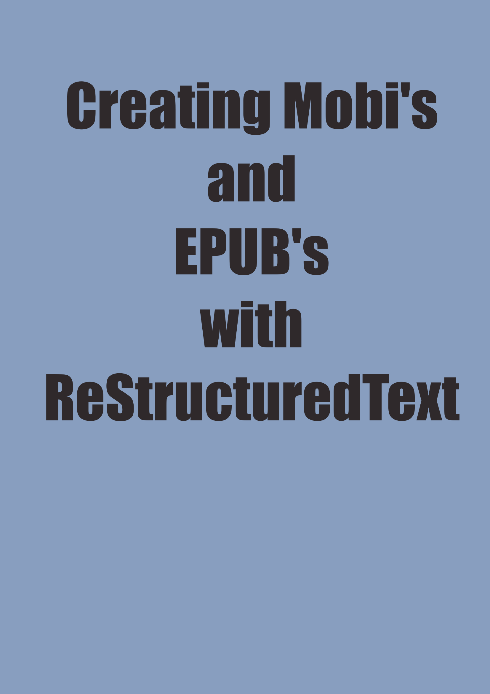

======================================================
Example ``rst2epub2.py`` Book
======================================================

.. this specifies the cover image

.. this is the metadata

:creator: Matt Harrison
:publisher: Matt Harrison
:title: Example ``rst2epub2.py`` Book
:description: Example of using rst for your book
:language: English
:subject: reStructuredText for ebooks
:rights: Copyright 2011 -- Matthew Harrison -- All rights reserved

Example ``rst2epub2.py`` Book
====================================

.. titlepage

.. The above comment indicates that this will be a titlepage

Matt Harrison

Copyright 2011

While every precaution has been taken in the preparation of this book,
the publisher and author assumes no responsibility for errors or
omissions, or for damages resulting from the use of the
information contained herein.

.. The table of contents will be created by the comment below

.. toc:show

Using ``rst`` for Books
=========================

.. this is the first chapter

Using rst is easy, open your favorite text editor and start
typing. Paragraphs look like you think they would.

Lists are pretty easy too. If you type a list like this::

  * Apples
  * Bannanas
  * Kiwi

Code example
============

Code can be listed like this::

  def foo(bar):
      # do something
      return bar + 1

Not bad!

Sidebar example
===============

Here is a side bar

.. note::

  This is a side bar, it should be formatted differently.

  It can contain code::

    def sidebar_func():
        pass

  Pretty nice!

Creating an epub
================

Run this command::

  PYTHONPATH=/path/to/rst2epub python path/to/rst2epub.py book.rst output.epub

To create a kindle book run::

  kindlegen output.epub

This will create a mobi file in the same directory as the epub
